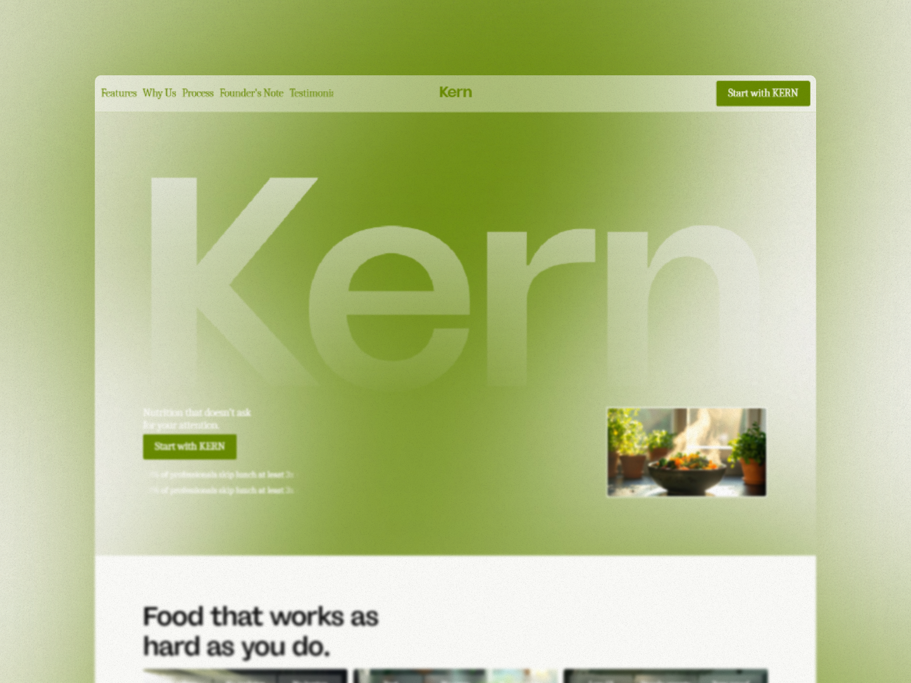

# KERN

> Full brand identity + Framer website for a functional nutrition brand targeting busy professionals.
> Editorial black/white aesthetic, olive green accent, dry sharp copy - zero wellness speak anywhere.

---

## Live Site

[KERN live site](https://kern-nutrition.framer.website)

---

## Links

[Upwork Project](https://www.upwork.com/freelancers/himdhara2002?p=2071114822500311040)

[Upwork Profile](https://www.upwork.com/freelancers/himdhara2002?mp_source=share)

[Full Case Study](./CASE-STUDY.md)

---

## Brand System

| Token | Hex |
|-------|-----|
| White | `#FAFAF7` |
| White - Trans | `#FAFAF7` at 50% |
| White - Trans 20 | `#FAFAF7` at 20% |
| Black | `#111111` |
| Grey | body text gray |
| Ascent | `#688A01` |
| Ascent - 20 | `#688A01` at 20% |

**Typography:**

| Role | Font | Size | Weight |
|------|------|------|--------|
| H1 | `Dx Ruiga Free` SemiBold | 54px / 1.1 | SemiBold |
| H2 | `Dx Ruiga Free` SemiBold | 45px / 1.1 | SemiBold |
| H3 | `Dx Ruiga Free` SemiBold | 37px / 1.2 | SemiBold |
| H4 | `Dx Ruiga Free` SemiBold | 31px / 1.2 | SemiBold |
| H5 | `Dx Ruiga Free` SemiBold | 26px / 1.2 | SemiBold |
| H6 | `Dx Ruiga Free` SemiBold | 22px / 1.3 | SemiBold |
| Body | `Caladea` Regular | 18px / 1.2 | Regular |
| Button | `Caladea` Regular | 18px / 1.2 | Regular |
| Small | `Caladea` Regular | 15px / 1.3 | Regular |

---

## What Was Built

```
Desktop
├── Nav
├── Main
│   ├── Hero Section
│   ├── Body
│   │   ├── Features Section
│   │   ├── Why Us Section
│   │   ├── How It Works Section
│   │   ├── Founders Section
│   │   └── Testimonials Section
│   └── CTA + Footer Section
│       ├── CTA
│       └── Footer
Tablet
Phone
```

---

## Built With

- Framer
- Google Fonts
- Firefly / Veo (image + video prompts)

---


*Designed & built by Himanshu Dhara - Framer Developer & Brand Designer - 2026*
